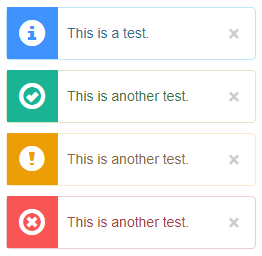

## 一个由jquery.bootstrap-growl修改的提示插件
必须引入jquery，bootstrap文件作为支持

主文件为notify.js

示例Demo为demo.html

效果如下：


基础用法：
```
$.bootstrapGrowl("My message");

$.bootstrapGrowl("Test message", {
    ele: 'body', // 绑定到某个元素  
    type: 'info', // 提示的类型  
    offset: {
        from: 'top', // 'top', or 'bottom'
        amount: 20   // 大小为px
    }, // 相对顶部或者底部的距离  
    align: 'right', // 可选参数('left', 'right', or 'center')  
    width: 250, // 宽度，单位为px
    delay: 4000, // 自动消失时间设置  
    allow_dismiss: true, // 是否出现关闭按钮
});
```